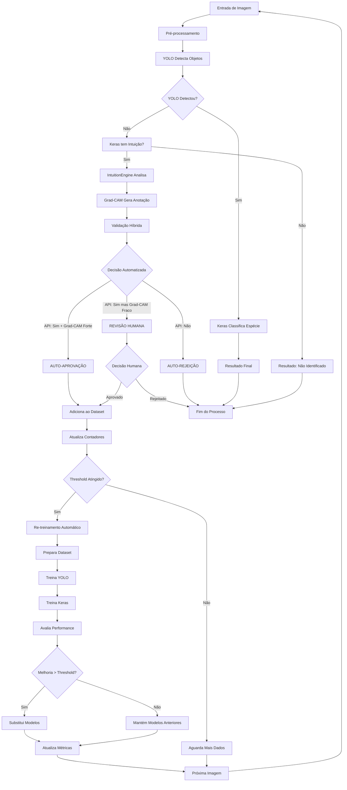
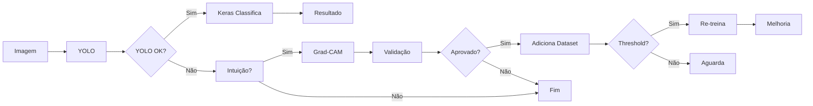
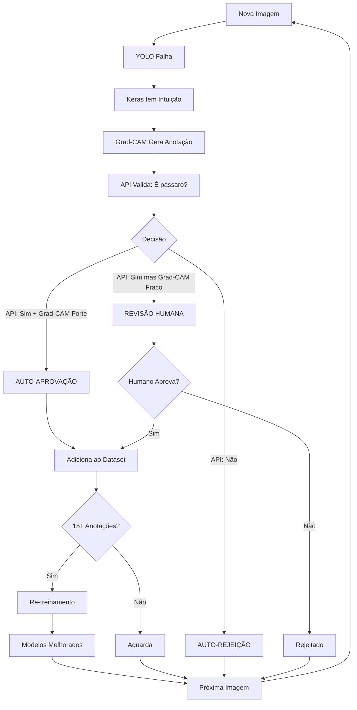
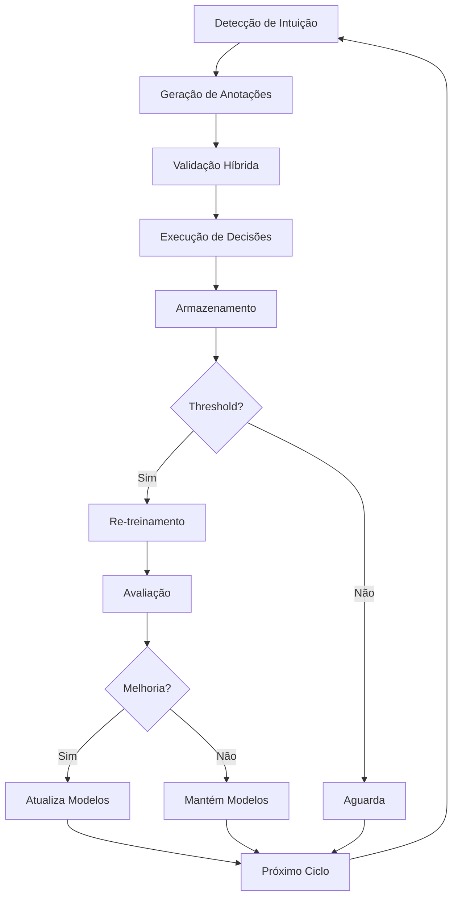

# 📊 FLUXOGRAMA EM FORMATO MERMAID

## Versão para uso em apresentações e documentação

### Fluxograma Completo

### Fluxograma Simplificado (Para Apresentação)

### Fluxograma do Sistema Santo Graal

### Fluxograma do Ciclo de Aprendizado Contínuo

## 📝 Como Usar

### Para Apresentação PowerPoint:
1. Copie o código Mermaid
2. Use ferramentas como:
   - [Mermaid Live Editor](https://mermaid.live/)
   - [Draw.io](https://app.diagrams.net/) (suporta Mermaid)
   - Extensões do VS Code para Mermaid
3. Exporte como imagem PNG/SVG
4. Insira na apresentação

### Para Documentação:
- O formato Mermaid é suportado nativamente em:
  - GitHub
  - GitLab
  - Notion
  - Muitos editores Markdown modernos

### Alternativa: Diagrama em Texto
- Use o arquivo `FLUXOGRAMA_PROCESSO.md` para versão em texto ASCII
- Pode ser convertido para diagrama visual usando ferramentas online

---

**Versão:** 1.0  
**Formato:** Mermaid Diagram  
**Compatibilidade:** GitHub, GitLab, Notion, VS Code, e muitos outros

